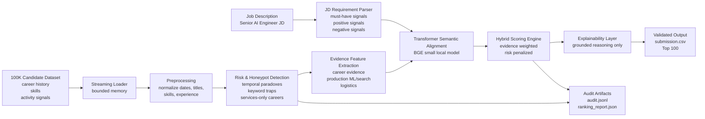

# Redrob Intelligent Candidate Discovery & Ranking - Hybrid Ranker

Solution for the Redrob AI x INDIA.RUNS Data & AI Challenge: rank the top 100 candidates from a 100,000-candidate pool for the **Senior AI Engineer - Founding Team** job description.

## Problem Statement

Traditional hiring tools miss strong candidates because they rely on keyword matching and can be fooled by noisy or keyword-stuffed resumes.

This project builds an offline intelligent ranking engine that analyzes full candidate profiles, detects traps, and produces an explainable top-100 candidate list.

## TL;DR

This is a hybrid, evidence-first candidate ranker. It combines deterministic profile cleaning, risk and honeypot detection, JD-specific career evidence extraction, local transformer semantic alignment, and transparent business scoring.

It is deliberately **not** a keyword matcher. Skills are treated as supporting evidence only; career history, shipped systems, role context, production relevance, availability, and risk consistency carry the ranking.

- **Final output:** `data/processed/full_rank_transformer/submission.csv`
- **Validation:** passes the official `validator/validate_submission.py`
- **Dataset size:** 100,000 candidates
- **Run machine:** MacBook Pro M5 Pro, 24 GB RAM, macOS 26.5.1, CPU-only
- **Top-100 audit:** 0 fatal honeypot flags, 0 services-only careers, 0 non-technical titles, 0 candidates with 120-day notice
- **Semantic model:** `BAAI/bge-small-en-v1.5`, used locally after a cheap prefilter
- **No hosted LLM/API calls during ranking**

## System Architecture



Pipeline:

```text
candidates.jsonl
  -> streaming loader
  -> preprocessing / normalization
  -> risk and honeypot detection
  -> JD evidence feature extraction
  -> local transformer semantic scoring
  -> hybrid scoring and business penalties
  -> grounded reasoning generation
  -> top-100 submission.csv
```

## How The Ranker Works

The final score is a weighted blend of role-fit evidence and business constraints:

```text
score =
  weighted_evidence(
    suitability_tier,
    career_evidence,
    semantic_alignment,
    search_ranking,
    vector_search,
    embeddings,
    evaluation,
    python,
    production,
    title_alignment,
    product_context,
    availability,
    location
  )
  - risk_penalties
  - business_penalties

fatal honeypot / contradiction flags force score = 0
```

Important design choices:

| Decision | Why it matters |
| --- | --- |
| Career evidence outweighs skills | The dataset contains noisy skills and keyword traps. A skill list alone should not rank a candidate. |
| Risk detection runs before scoring | Honeypots, impossible timelines, and services-only profiles should not survive just because they contain AI terms. |
| Transformer alignment is gated by prefiltering | The model helps compare JD meaning to profile context, but it does not rescue unrelated candidates with weak career evidence. |
| Business constraints are explicit | Notice period, activity, recruiter response rate, location, and relocation matter for a founding startup role. |
| Reasoning is generated from extracted facts | Explanations use only candidate profile fields and audit evidence, avoiding hallucinated justifications. |

## Trap And Honeypot Handling

The ranker checks suspicious candidates before final ranking:

- impossible timeline or date contradictions
- last active date before signup date
- career duration inconsistent with total experience
- AI keyword stuffing without career evidence
- non-technical current role with dense AI skills
- services/consulting-only career history
- CV/speech/robotics-only backgrounds without retrieval/search overlap
- architect/manager profiles with weak recent hands-on production work
- inactive profiles, low recruiter response, or very long notice period

Severe contradictions are hard-zeroed. Uncertain risks are penalized and surfaced as tradeoffs in the reasoning.

## Why This Is Not Keyword Matching

A keyword matcher would reward profiles that simply list terms like LLM, FAISS, embeddings, BM25, or vector database names.

This system asks stronger questions:

- Did the candidate actually build or ship a ranking, search, retrieval, recommendation, or matching system?
- Was the work done in a product/startup context relevant to Redrob?
- Is there evidence of evaluation, latency, feedback loops, A/B testing, or production ownership?
- Are the candidate's title, experience, skills, career history, and platform signals internally consistent?
- Is the candidate reachable and realistically hireable for the JD timeline?

## Results And Validation

Latest full transformer run:

```text
total candidates: 100000
semantic encoded after prefilter: 2235
semantic skipped by prefilter: 97765
transformer feature extraction elapsed: 394.9s / 6m 34.9s
final ranking from cached features: 2.46s
final output rows: 100
official validator: passed
```

Latest top-100 audit:

```text
top100 rows: 100
fatal honeypot flags: 0
last_active_before_signup: 0
120-day notice candidates: 0
services-only careers: 0
weak career evidence candidates: 0
non-technical titles: 0
```

Validate the final CSV:

```bash
python3 validator/validate_submission.py data/processed/full_rank_transformer/submission.csv
```

Expected output:

```text
Submission is valid.
```

## Reproduce

### 1. Install core requirements

```bash
pip install -r requirements.txt
```

For transformer scoring:

```bash
pip install -r requirements-transformer.txt
python3 -c "from sentence_transformers import SentenceTransformer; SentenceTransformer('BAAI/bge-small-en-v1.5', device='cpu')"
```

### 2. Fast ranking from precomputed feature records

This is the strict CPU-only ranking step:

```bash
python3 rank.py \
  --features data/processed/full_features_transformer/candidate_features.jsonl \
  --out data/processed/full_rank_transformer/submission.csv
```

### 3. Full local pipeline from raw candidates

```bash
python3 rank.py \
  --candidates data/candidates.jsonl \
  --out data/processed/repro/submission.csv \
  --work-dir data/processed/repro \
  --semantic-backend transformer \
  --semantic-model BAAI/bge-small-en-v1.5 \
  --semantic-batch-size 64 \
  --semantic-no-fallback \
  --force
```

The full local transformer feature pass is an offline precompute stage and can exceed a strict five-minute budget on CPU. The final ranking from precomputed feature records is fast and offline.

### 4. Dependency-light fallback

If transformer dependencies or local model files are unavailable:

```bash
python3 rank.py \
  --candidates data/candidates.jsonl \
  --out data/processed/repro_hashed/submission.csv \
  --work-dir data/processed/repro_hashed \
  --semantic-backend hashed \
  --force
```

## Repository Layout

```text
app/
  io.py          streaming JSON / JSONL / GZ helpers
  preprocess.py cleaning and normalization
  risk.py       trap, honeypot, and contradiction detection
  features.py   JD evidence and semantic feature extraction
  semantic.py   hashed fallback and local transformer backend
  scoring.py    final ranking, reasoning, audit output

rank.py                     one-command reproduction entrypoint
sandbox_app.py              small Gradio demo
Dockerfile                  Hugging Face Space runtime
requirements.txt            core dependency-light pipeline
requirements-transformer.txt optional transformer backend
requirements-sandbox.txt    sandbox dependencies
validator/                  official format validator
tests/                      regression tests
```

## Tests

```bash
python3 -m unittest discover -s tests
```

Current test status:

```text
Ran 28 tests
OK
```

## Sandbox Demo

Run locally:

```bash
pip install -r requirements-sandbox.txt
python sandbox_app.py
```

Deploy to Hugging Face Spaces:

```bash
python3 -m venv .venv-hf
.venv-hf/bin/python -m pip install "huggingface_hub[cli]"
.venv-hf/bin/hf auth login
scripts/deploy_hf_space.sh YOUR_HF_USERNAME/redrob-candidate-ranker-sandbox
```

The sandbox accepts a small `.json`, `.jsonl`, or `.jsonl.gz` candidate file and returns a ranked CSV preview. It is a demo surface, not the full 100K production run.

## Final System Specs

| Field | Value |
| --- | --- |
| Team | Team Astro |
| Member | Abishek Priyan M |
| GitHub repository | https://github.com/Unknown-guy-369/Intelligent-candidate-rank-system.git |
| Sandbox URL | https://huggingface.co/spaces/abishek-priyan-369/redrob-candidate-ranker-sandbox |
| Final run machine | MacBook Pro M5 Pro, 24 GB RAM |
| Operating system | macOS 26.5.1 |
| Ranking mode | CPU-only, offline, from precomputed transformer feature records |
| Transformer feature precompute time | 394.9s / 6m 34.9s |
| Final ranking time | 2.46s over 100,000 feature records |

## Submission Assets

- GitHub repository with source code, docs, tests, and reproduction commands
- Final `submission.csv`
- `audit.jsonl` and `ranking_report.json`
- Hugging Face / Gradio sandbox demo
- PPT
- AI tools declaration in `submission_metadata.yaml`

## AI Tools Declaration

OpenAI Codex was used for coding assistance, debugging, documentation drafting . The architecture, methodology, ranking strategy, and final engineering decisions were directed and approved by the author. The ranking pipeline itself does not call hosted LLM APIs and does not send candidate data to external LLM services during ranking.
